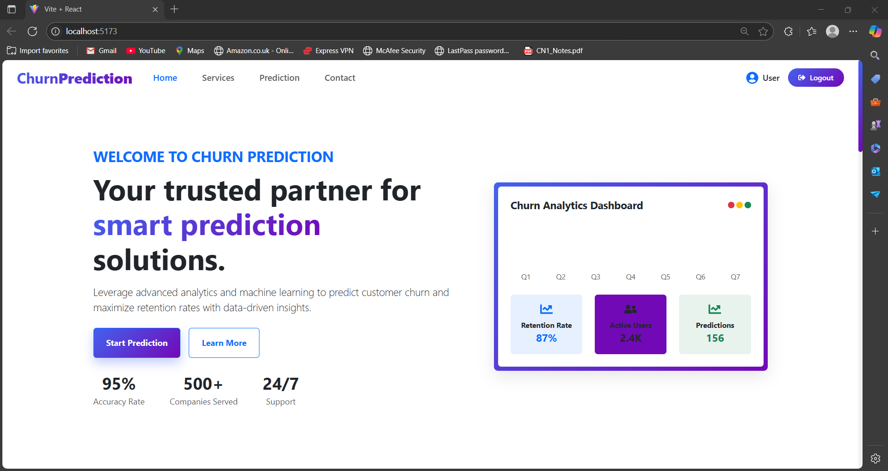
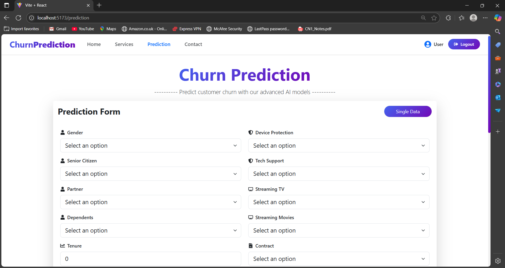
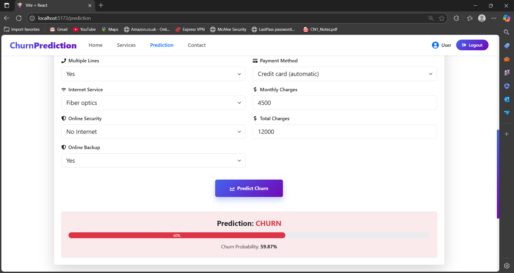
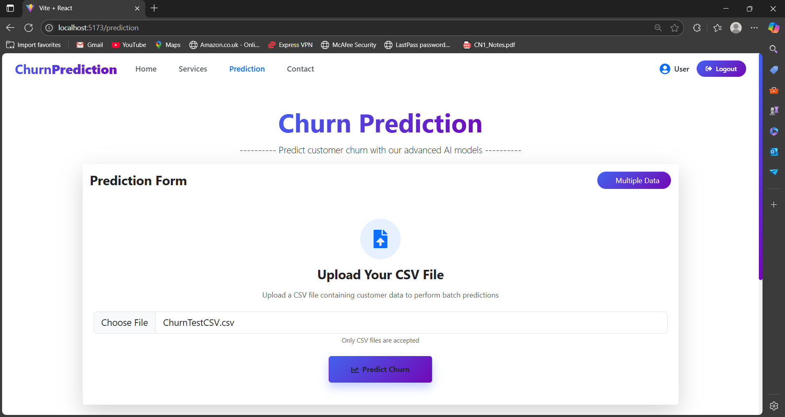
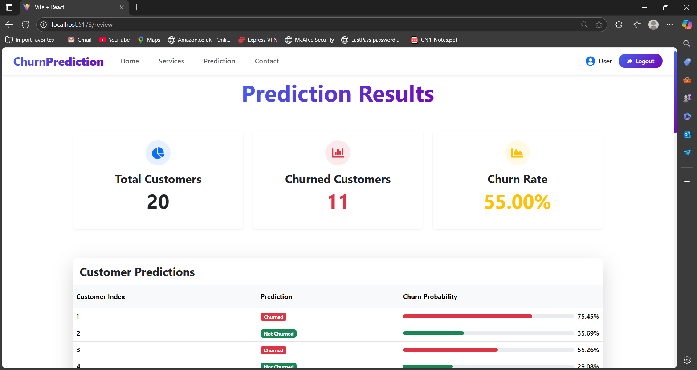
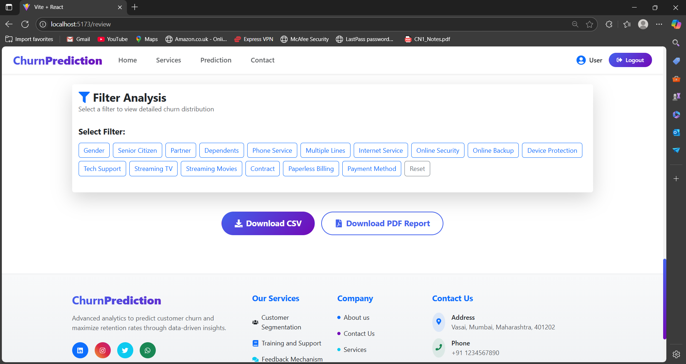

# 📉 Customer Churn Prediction System

A machine learning-based full-stack web application that predicts whether a customer is likely to churn, empowering businesses to make proactive retention decisions using data-driven insights.

---

## 🚀 Project Overview

The **Customer Churn Prediction System** is a predictive analytics platform built using Python and Flask. It allows businesses to upload customer data (single or bulk via CSV), apply trained ML models, and generate churn reports with actionable visual insights.

It leverages supervised machine learning algorithms and provides both real-time prediction and batch processing features via a web interface.

---

## 🧩 Features

✅ Predict Customer Churn (Single & Bulk Input)  
🧠 Machine Learning Models: Logistic Regression, Decision Tree, XGBoost, Random Forest  
📊 Best Accuracy: Random Forest (Fine-Tuned)  
📁 Upload CSV File for Batch Processing  
📤 Auto-Generates CSVs for Churned & Non-Churned Customers  
📈 Visual Analysis of Churn Data (Graphs & Charts)  
📄 Downloadable Report for Business Use  
💻 Clean and Minimal Flask-based Web Interface  

---

## 🛠 Tech Stack

**ML & Backend:**
- Python (Pandas, NumPy, Scikit-learn, XGBoost)
- Jupyter / Google Colab (Model Development)
- Flask (Web Framework)

**Frontend:**
- React (Optional, if integrated)
- Bootstrap (For Styling)

**Visualization:**
- Matplotlib, Seaborn, Plotly

**Deployment:**
- Localhost / Render / PythonAnywhere (optional)

---

## ⚙️ Setup Instructions

### 1. Clone the Repository
```bash
git clone https://github.com/your-username/customer-churn-prediction.git
cd customer-churn-prediction
```

### 2. Create Virtual Environment (Optional but Recommended)
```bash
python -m venv venv
source venv/bin/activate  # for Linux/macOS
venv\Scripts\activate     # for Windows
```

### 3. Install Python Dependencies
```bash
pip install -r requirements.txt
```

### 4. Run the Flask Application
```bash
python app.py
```

### 5. Access the Web Interface
Visit in browser:
```bash
http://localhost:5000
```

### ✅ To Screenshot & How it Work:
## 📸 Screenshots

### Landing Page  


### Prediction  


### Predicited Single User  


### Prediction Mutiple user 


### Predicted Multiple user


### Analysis 


---

## 🎥 Demo


